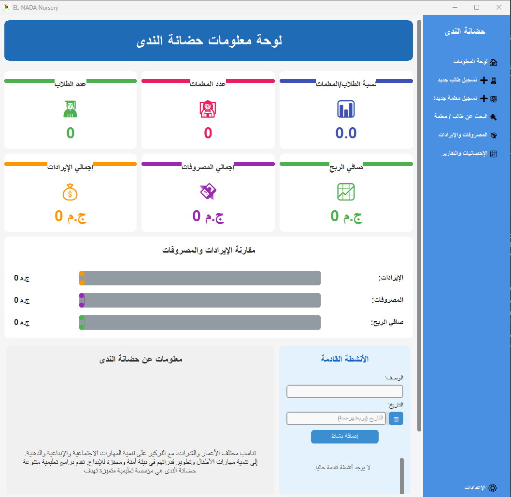
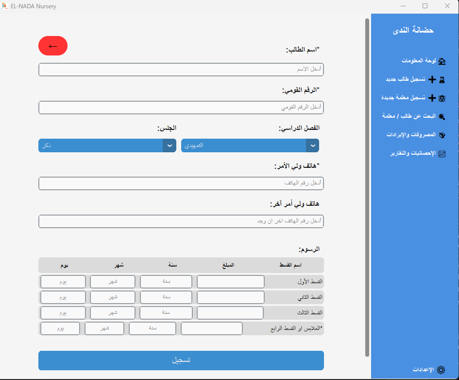
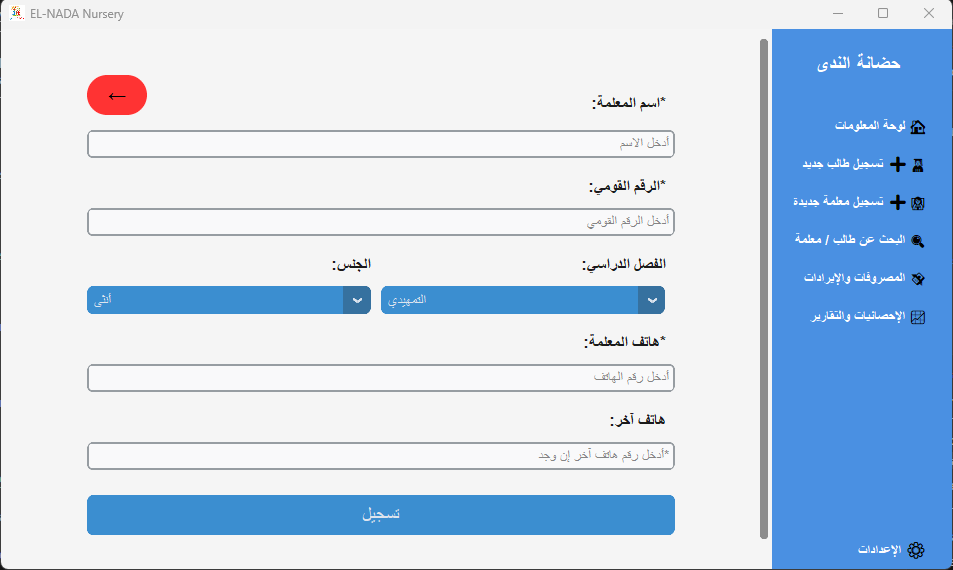
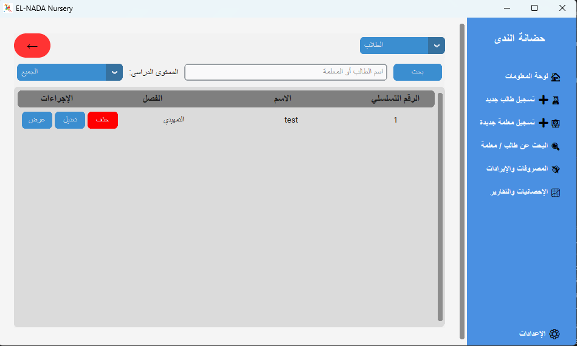
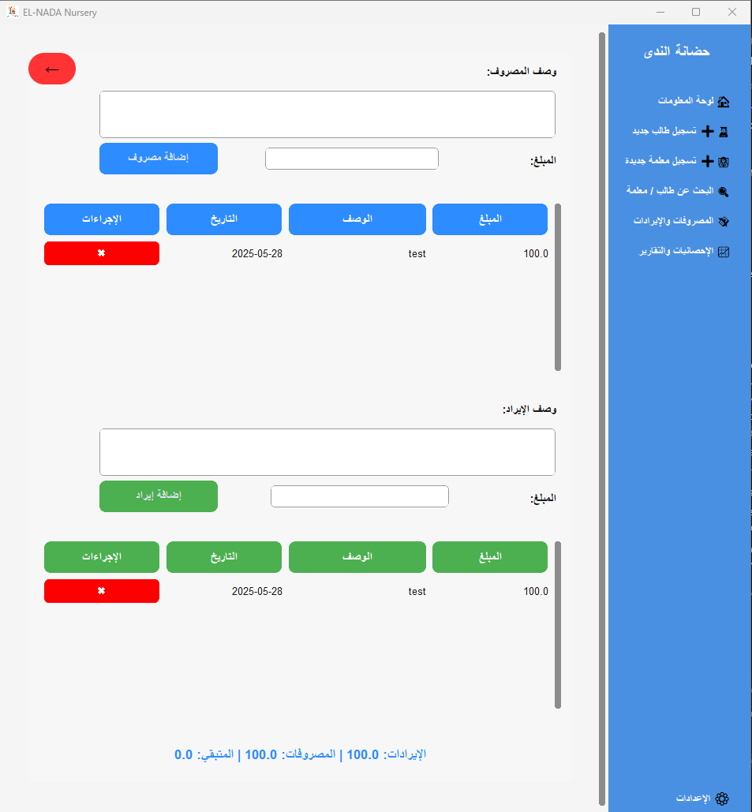
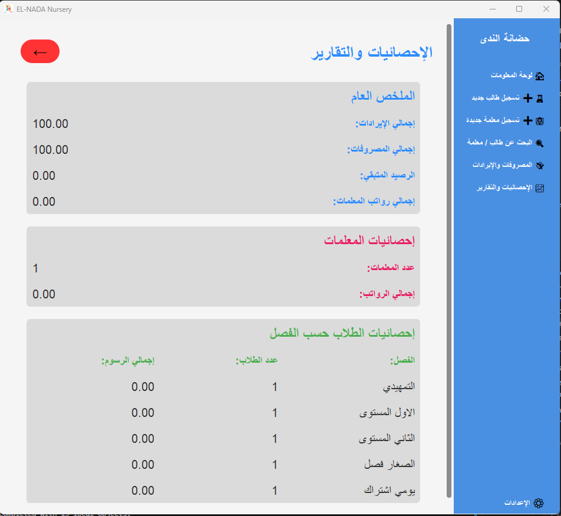
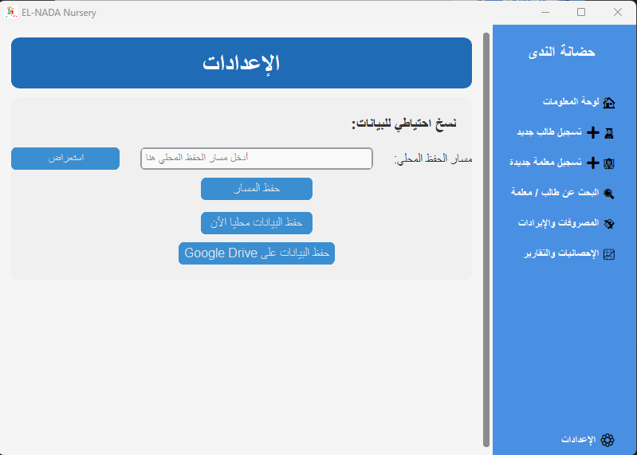

# EL-NADA Nursery Management System

## Project Description

EL-NADA Nursery Management System is a desktop application built with CustomTkinter and SQLite designed to streamline administrative tasks for a kindergarten or nursery. The system provides functionalities for managing student and teacher records, tracking fees and expenses, generating reports, and handling data backups.

## Features

- **Student Management:** Register, view, edit, and delete student records.
- **Teacher Management:** Register, view, edit, and delete teacher records.
- **Financial Tracking:** Record and manage income and expenses.
- **Reporting:** Generate statistics and reports on students, teachers, and finances.
- **Data Backup:** Local and Google Drive backup options for data safety.
- **Activities Management:** Track upcoming activities.
- **User-Friendly Interface:** Intuitive and easy-to-navigate graphical user interface.
- **Multi-Resolution Support:** Application layout and elements are designed to adapt to different screen sizes and resolutions.

## Getting Started

Follow these instructions to set up and run the project locally.

### Prerequisites

- Python 3.7 or higher
- Git

### Installation

1.  **Clone the repository:**

    ```bash
    git clone <repository_url>
    cd Elnada_project
    ```

2.  **Create a virtual environment:**

    ```bash
    python -m venv venv
    ```

3.  **Activate the virtual environment:**

    - On Windows:

      ```bash
      .\venv\Scripts\activate
      ```

    - On macOS and Linux:

      ```bash
      source venv/bin/activate
      ```

4.  **Install dependencies:**

    ```bash
    pip install -r requirements.txt
    ```

## Running the Application

After installing the dependencies, you can run the application directly:

```bash
python main.py
```

## Building the Executable (.exe)

The project includes scripts to build a standalone Windows executable using PyInstaller.

- `ELNADA.spec`: This is the PyInstaller specification file. It contains all the configuration needed by PyInstaller to bundle the application, including specifying the main script (`main.py`), hidden imports, data files (like images, backend/frontend modules, Google API credentials, etc.), and output options (like the executable name and icon).

- `build.bat` (for Windows):
  This is a Windows Batch script that automates the build process. It performs the following steps:

  1.  Activates the Python virtual environment.
  2.  Ensures all required packages are installed/upgraded using `requirements.txt`.
  3.  Runs the PyInstaller command using the `ELNADA.spec` file to build the executable.
  4.  Prints messages indicating the build progress and completion.

- `build.sh` (for Linux/macOS, though currently configured to call `build.bat` on Windows):
  This is a shell script. In its current state, it's set up to check the operating system and call `build.bat` if running on Windows under a shell like Git Bash. For building on other operating systems, the PyInstaller command within this script would need to be adapted (e.g., directly running `pyinstaller --clean ELNADA.spec`).

To build the `.exe` file:

1.  **Activate your virtual environment** (if not already active):

    - On Windows:

      ```bash
      .\venv\Scripts\activate
      ```

    - On macOS and Linux (using Git Bash or similar on Windows):

      ```bash
      source venv/bin/activate
      ```

2.  **Run the build script:**

    - On Windows Command Prompt/PowerShell:

      ```bat
      build.bat
      ```

    - On Git Bash (on Windows): The `build.sh` script is intended for this environment.

      ```bash
      ./build.sh
      ```

    The executable will be generated in the `dist` folder.

## Multi-Resolution Support Details

The application is designed to be responsive:

- **Automatic Element Scaling:** Element sizes adjust based on screen DPI and resolution.
- **Responsive Layout:** Layouts adapt when the window is resized.
- **Minimum Size:** A minimum window size of 800x540 is set.

Tips for Development (regarding responsiveness):

- Use `sticky="nsew"` or appropriate sticky options with `grid`.
- Utilize `grid_rowconfigure` and `grid_columnconfigure` with `weight=1` for expandable rows/columns.
- Prefer relative sizing over fixed pixel sizes where possible.

## Screenshots

Here are some screenshots illustrating the application's user interface:

### Dashboard



### Student Registration Page



### Teacher Registration Page



### Search Page



### Fees and Income/Expenses Page



### Statistics and Reports Page



### Settings Page



_Note: Please replace the example image paths (`images/...`) with the actual paths to your screenshot files within the repository._

## Technologies Used

- Python
- CustomTkinter
- SQLite
- Google Drive API (for backup)
- PyInstaller (for building executable)

---

Project maintained by [Osama Morsy]
