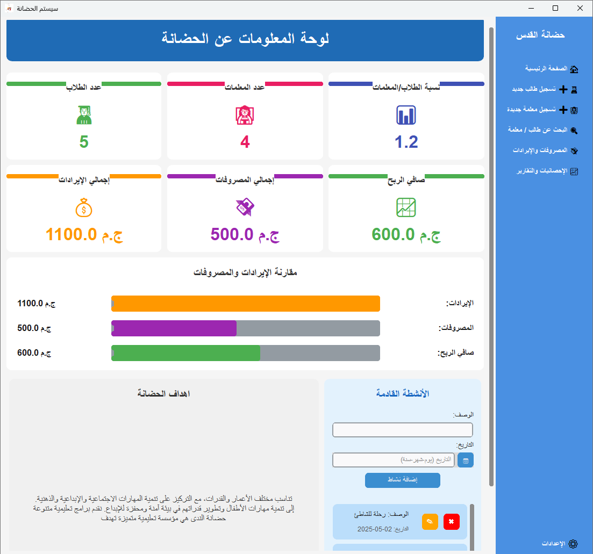
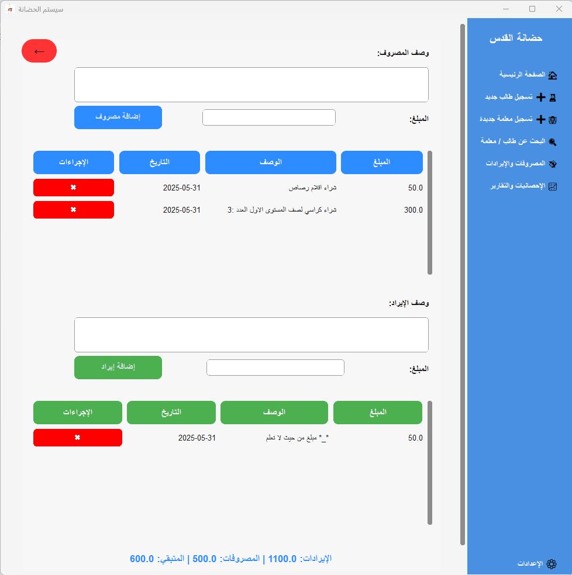
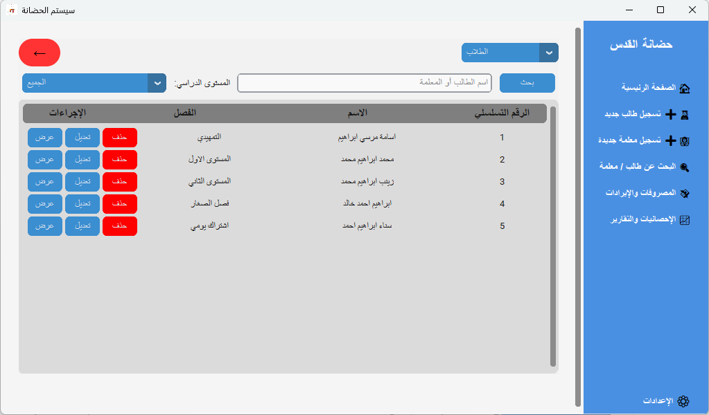
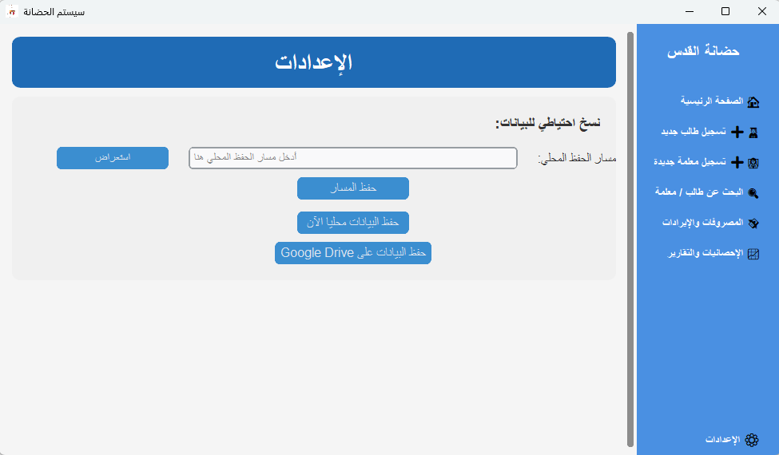
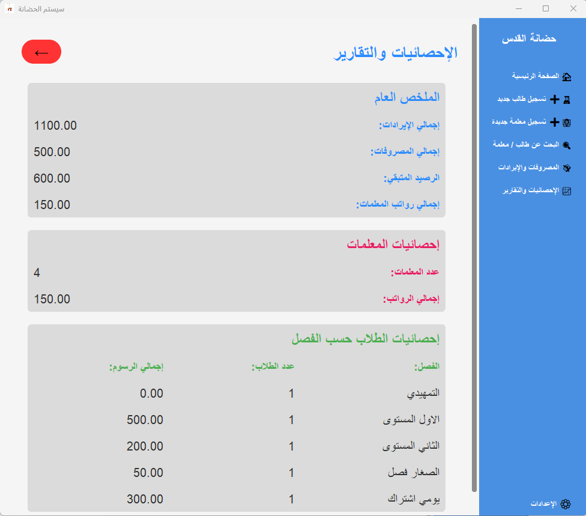
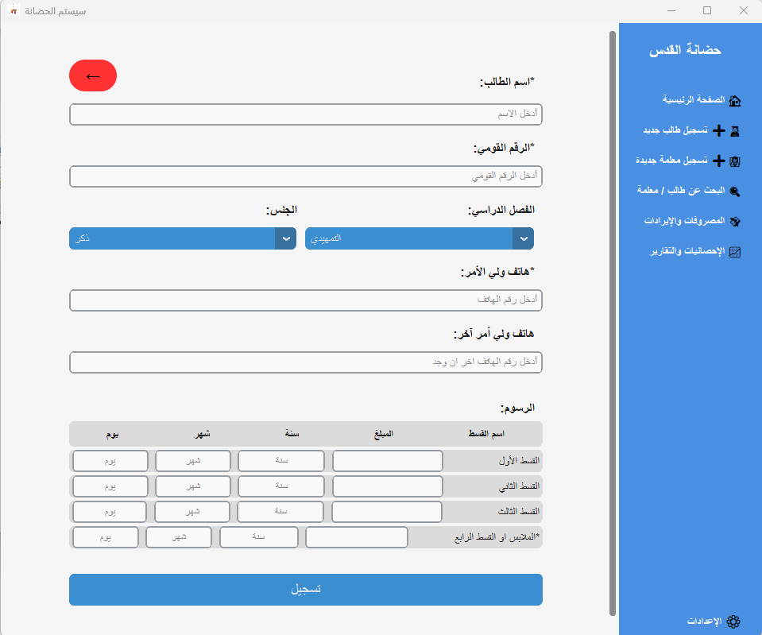
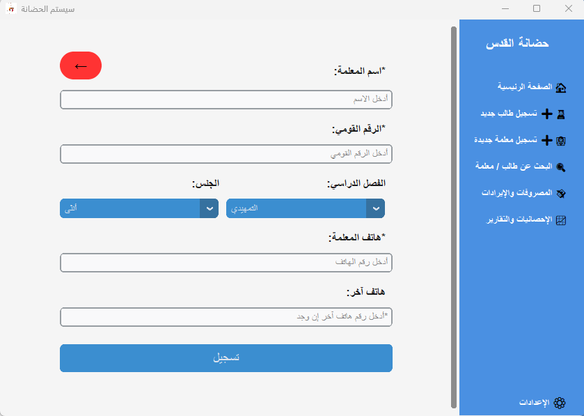

# Nursery System

## About the Project

"Nursery System" is a comprehensive management system specifically designed to meet the needs of nurseries. The project aims to streamline and organize daily tasks such as registering students and teachers, tracking attendance, managing fees and expenses, and generating statistical reports.

This system was developed using the Python programming language and the CustomTkinter GUI library. **One of the main challenges overcome in this project was fully integrating and supporting the Arabic language in the user interface, given the known difficulties in handling Arabic with some Python GUI libraries.**

## Key Features

- **Student Management:** Registering student data, parent contact information, and tracking student status.
- **Teacher Management:** Registering teacher data and contact information.
- **Fees and Expense Management:** Recording and collecting fees, registering various expenses, and tracking the nursery's financial status.
- **Statistical Reports:** Generating reports on student numbers, fee status, and expenses to aid in decision-making.
- **Arabic Language Support:** Full Arabic language UI and interactions.
- **Cloud Data Backup:** Ability to back up and restore the database to Google Drive (requires setup).

## Technologies Used

- Python
- CustomTkinter (for the GUI)
- SQLAlchemy (for database management)
- Google API Client Library for Python (for Google Drive interaction)
- PyInstaller (for converting code to executable)
- `arabic-reshaper` and `python-bidi` (for Arabic language support)

## Screenshots















## Setup and Installation

To run the project from source code on your machine, follow these steps:

### Prerequisites

- Python 3.7+
- Git

### Steps

1.  **Clone the repository:**

    ```bash
    git clone https://github.com/ItsDev7/Nursery-system.git
    cd Nursery-system
    ```

2.  **Create and activate a virtual environment (recommended):**

    - **On Windows:**
      ```bash
      python -m venv venv
      .\venv\Scripts\activate
      ```
    - **On macOS and Linux:**
      ```bash
      python3 -m venv venv
      source venv/bin/activate
      ```

3.  **Install dependencies:**

    ```bash
    pip install -r requirements.txt
    ```

4.  **Set up Google Drive API (for cloud backup):**
    To enable the Google Drive backup feature, you need to obtain your own `credentials.json` file from the Google Cloud Console.

    - Go to the [Google Cloud Console](https://console.cloud.google.com/).
    - Create a new project (if you don't have one).
    - Enable the Google Drive API for this project.
    - Go to "APIs & Services" -> "Credentials".
    - Click on "Create Credentials" and choose "OAuth client ID".
    - The application type is "Desktop app".
    - Download the `credentials.json` file.
    - **Place the downloaded `credentials.json` file in the main project directory (`Nursery-system/`).**

5.  **Run the application:**
    After completing the above steps, you can run the application:
    ```bash
    python main.py
    ```

## Building an Executable

If you want to build an executable version of the system (e.g., an `.exe` file on Windows), you can use the provided scripts with PyInstaller.

- **On Windows:**
  Use the `build.bat` file. Ensure PyInstaller is installed (it's included in `requirements.txt`).
  ```bash
  build.bat
  ```
- **On macOS and Linux:**
  Use the `build.sh` file. Ensure PyInstaller is installed.
  ```bash
  ./build.sh
  ```

The resulting executable will be found in the `dist` folder.

## Download Pre-built Version

You can also download a pre-built version of the application from the [Releases](https://github.com/ItsDev7/Nursery-system/releases) section of this repository.

## Contributing

Contributions to this project are welcome! If you find any issues or have suggestions for new features, please open a new [Issue](https://github.com/ItsDev7/Nursery-system/issues). If you want to contribute code, please open a [Pull Request](https://github.com/ItsDev7/Nursery-system/pulls).

## License

This project is licensed under the [MIT License](LICENSE).
